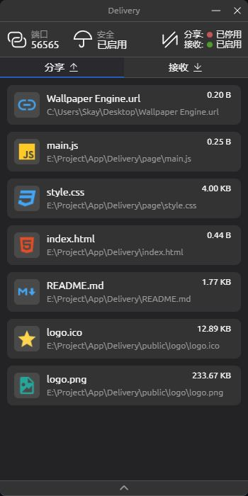

# Delivery

[](LICENSE)

[](https://nodejs.org/)

> Delivery is in its early stages and is not yet available!

## How to start development

```shell
# Clone code
git clone https://github.com/skay-zhang/Delivery.git ./Delivery
# Enter directory
cd Delivery
# Install dependency
yarn install
# Run project
yarn run app:dev
```

## 🗂 File Structure

* /page ··············> User interface folder
* /public ············> Static resources folder
* /basic ·············> Electron portal
* index.html ······> Vite portal file
* package.json ·> Project config file
* vite.config.js ··> Vite config file

## 🛠 Route

* [ ] Basic UI: Includes only transfer-related screens
* [ ] HTTP Service: for LAN transmission
* [ ] WebRTC Service: for WAN transmission
* [ ] P2P ICE: for transmission without public IP
* [ ] Advanced UI: Refine all interfaces
* [ ] Authentication Service: for securing application data
* [ ] Logging Service: used to record application operation logs

## 📦 Dependencies

> There are no strict versioning requirements for dependencies not mentioned in the list

* Electron >= 19.0.9
* NodeJS >= 16.16.0
* Vite == 2.9.13
* Vue >= 3.2.37

## 💻 Screenshot



## 😊 Thanks
Thanks to the following projects that make Delivery possible.

* [Electron](https://github.com/electron/electron)
* [NodeJS](https://github.com/nodejs/node)
* [Vite](https://github.com/vitejs/vite)
* [Vue](https://github.com/vuejs/vue)
* [Electron Builder](https://github.com/electron-userland/electron-builder)
* [Element Plus](https://github.com/element-plus/element-plus)

## License

[MIT](LICENSE)