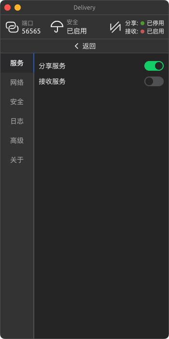

# Delivery

[](LICENSE)

[](https://nodejs.org/)
[](https://github.com/skay-zhang/Delivery/security/code-scanning)

[](https://sonarcloud.io/summary/new_code?id=skay-zhang_Delivery)
[](https://sonarcloud.io/summary/new_code?id=skay-zhang_Delivery)
[](https://sonarcloud.io/summary/new_code?id=skay-zhang_Delivery)
[](https://sonarcloud.io/summary/new_code?id=skay-zhang_Delivery)
[](https://sonarcloud.io/summary/new_code?id=skay-zhang_Delivery)

> Delivery is in its early stages and is not yet available!

* [🚀 Quick Start](#-quick-start)
* [🗂 File Structure](#-file-structure)
* [🛠 Route](#-route)
* [🧩 Interface](#-interface)
* [📦 Dependencies](#-dependencies)
* [💻 Screenshot](#-screenshot)
* [😊 Thanks](#-thanks)
* [❌ Building Problems](#-building-problems)
* [🎟 License](#-license)

## 🚀 Quick Start

```shell
# Clone code
git clone https://github.com/skay-zhang/Delivery.git ./Delivery
# Enter directory
cd Delivery
# Install dependency
yarn install
# Run project
yarn run app:dev
```

## 🗂 File Structure

* /page ··············> User interface folder
* /public ············> Static resources folder
* /basic ·············> Electron portal
* index.html ······> Vite portal file
* package.json ·> Project config file
* vite.config.js ··> Vite config file

## 🛠 Route

* [X] Basic UI: Includes only transfer-related screens
* [X] HTTP Service: for LAN transmission
* [ ] Web Client: HTTP service client
* [ ] WebRTC Service: for WAN transmission
* [ ] P2P ICE: for transmission without public IP
* [ ] Advanced UI: Refine all interfaces
* [ ] Authentication Service: for securing application data
* [ ] Logging Service: used to record application operation logs

## 🧩 Interface

### HTTP

| address | method | purpose |
| -- | -- | -- |
| /api/state | GET | Get service status |
| /api/list | GET | Get file list |
| /api/down/* | GET | Download file |
| /api/upload | POST | Upload file |

### WebRTC

Coming soon...

## 📦 Dependencies

> There are no strict versioning requirements for dependencies not mentioned in the list

* Electron >= 19.0.9
* NodeJS >= 16.16.0
* Vite == 2.9.13
* Vue >= 3.2.37

## 💻 Screenshot

<div>
  
  
  
</div>

## 😊 Thanks
Thanks to the following projects that make Delivery possible.

* [Electron](https://github.com/electron/electron)
* [NodeJS](https://github.com/nodejs/node)
* [Vite](https://github.com/vitejs/vite)
* [Vue](https://github.com/vuejs/vue)
* [Pinia](https://github.com/vuejs/pinia)
* [Electron Builder](https://github.com/electron-userland/electron-builder)
* [Element Plus](https://github.com/element-plus/element-plus)
* [Sonar Cloud](https://sonarcloud.io/)

## ❌ Building Problems

you need to add `if(!statuses.message) return;` to **http-errors** after line **260** of **index.js** before.

[issues#92](https://github.com/jshttp/http-errors/issues/92)

[No further execution when message are empty](https://github.com/skay-zhang/http-errors/commit/9130e5a960571863a9204cf4fb34cc3014499e52)

## 🎟 License

[MIT](LICENSE)